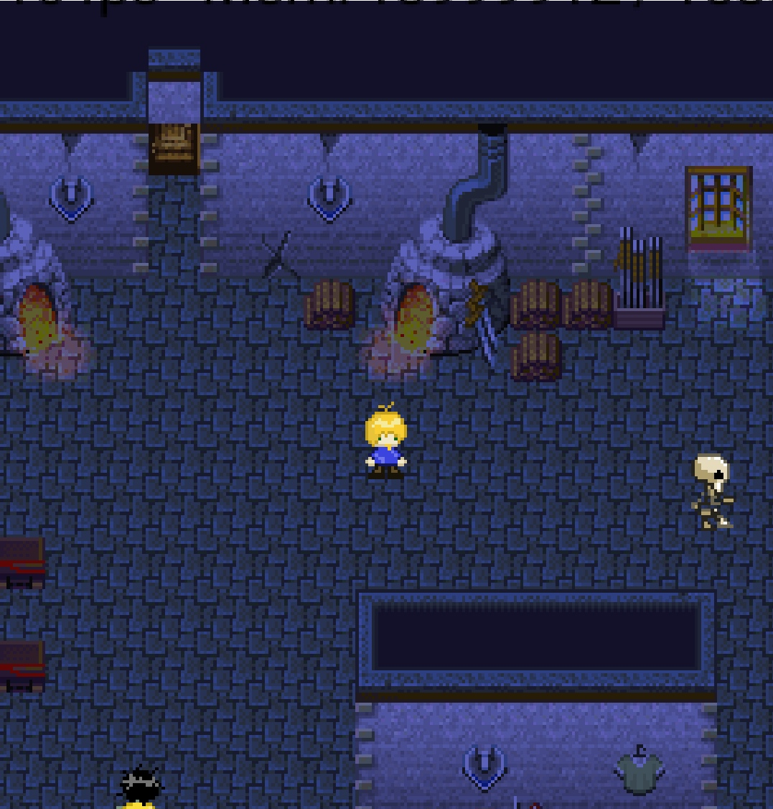

# Chaos Campus

Chaos Campus was a german university project where computer science students created a J2ME mobile game for feature phones. 

You are playing a student called Simon. An evil witch has kidnapped the university president and she released a poisonous substance on the university campus to convert all students to monsters. Simon must solve riddles and engage in boss fights to rescue the president and fellow students.

The game language is german.

[Download (jar)](https://woizischke.com/chaos-campus.jar)

There is an Android port of this game available on [Google Play](https://play.google.com/store/apps/details?id=com.deadlinegamedev.chaoscampus) and GitHub at [chrwoizi/chaos-campus-android](https://github.com/chrwoizi/chaos-campus-android). Alternatively you can run the jar file in a J2ME emulator such as [J2ME-Loader](https://play.google.com/store/apps/details?id=ru.playsoftware.j2meloader).

Additional information
---

[Download Presentation (PDF)](https://woizischke.com/chaos-campus.pdf)

Website: [woizischke.com/chaoscampus](https://woizischke.com/chaoscampus/index.html)

Screenshots
---

